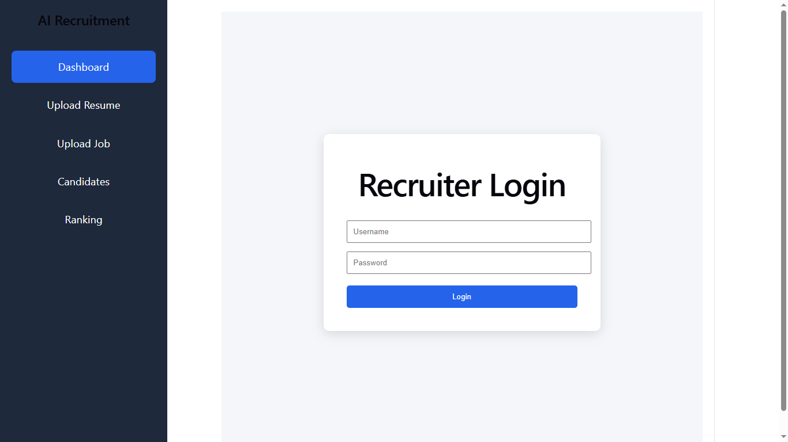
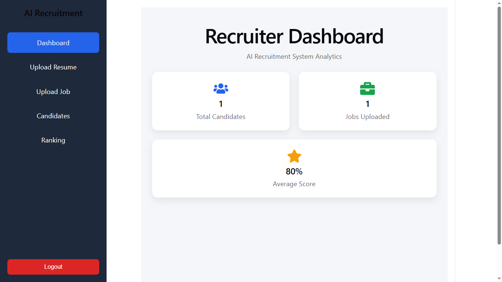
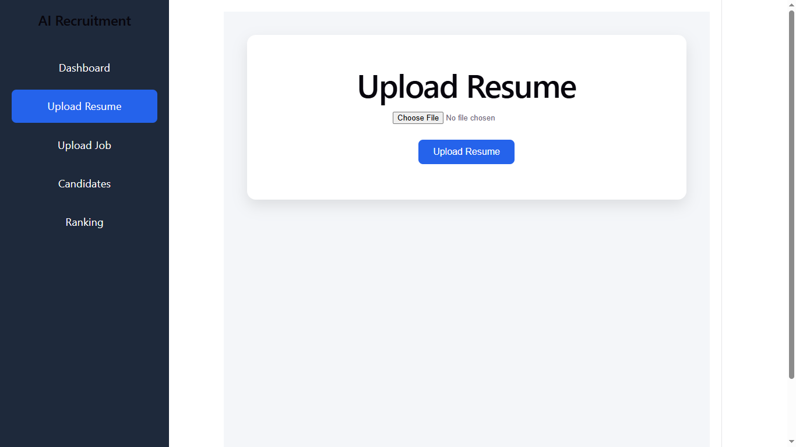
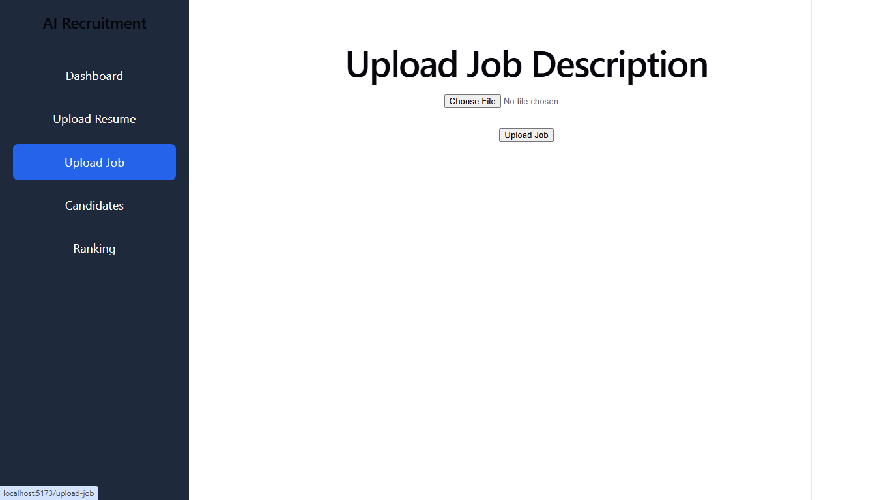
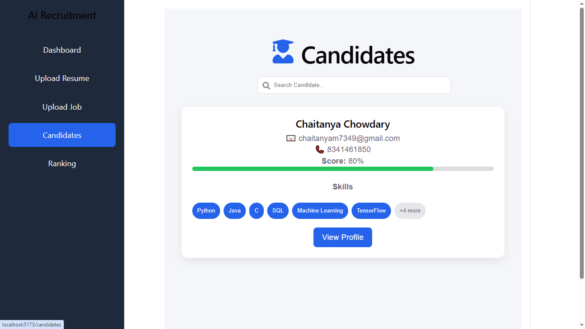
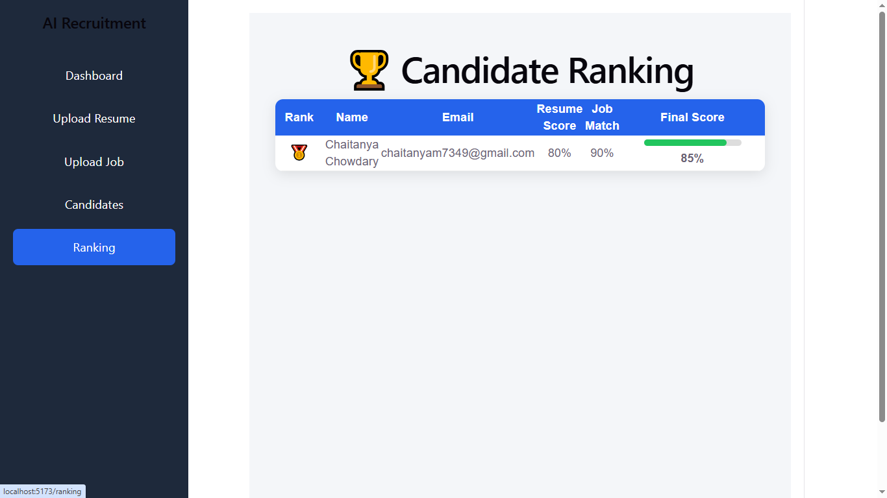
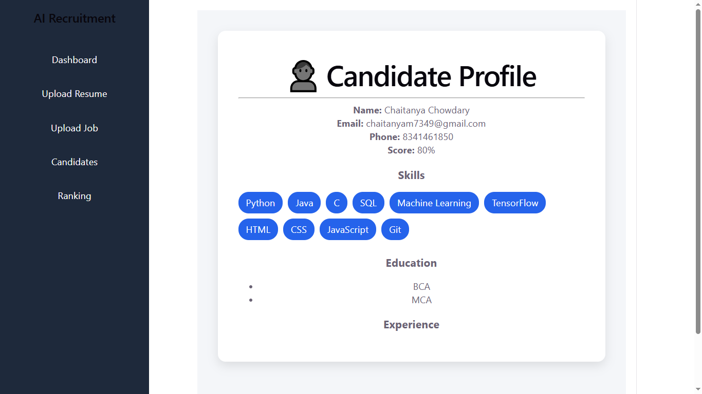

# AI Recruitment System

An AI-powered Recruitment System that automates resume screening, candidate ranking, job matching, and recruiter authentication using NLP and Machine Learning techniques.

---

## Features

- Recruiter Authentication (JWT Login)
- Protected Routes
- Recruiter Logout
- Upload Resume (PDF)
- Resume Parsing
- Upload Job Description
- Extract Required Skills
- AI Candidate Ranking
- Resume Scoring
- Candidate Search
- Candidate Details
- Download Resume
- Dashboard Analytics
- Duplicate Resume Detection

---

## Tech Stack

### Frontend
- React.js
- Axios
- React Router
- React Icons

### Backend
- FastAPI
- Python
- SQLAlchemy
- SQLite
- JWT Authentication

### AI & NLP
- Resume Parsing
- Skill Extraction
- Candidate Matching
- Resume Scoring

---

## Project Structure

```text
AI-Recruitment-System
│
├── backend
│   ├── app
│   ├── api
│   ├── auth
│   ├── database
│   ├── services
│   ├── uploads
│   ├── requirements.txt
│   └── recruitment.db
│
├── frontend
│   ├── src
│   ├── public
│   └── package.json
│
├── screenshots
│
└── README.md
```

---

## Installation

### Backend

```bash
cd backend
pip install -r requirements.txt
uvicorn app.main:app --reload
```

### Frontend

```bash
cd frontend
npm install
npm run dev
```

---

## Project Workflow

1. Recruiter Login (JWT Authentication)
2. Upload Resume
3. Resume Parsing
4. Upload Job Description
5. Extract Required Skills
6. Match Candidate Skills
7. Calculate Resume Score
8. Rank Candidates
9. View Candidate Details
10. Download Resume
11. Recruiter Logout

---

## Future Enhancements

- Email Notifications
- Interview Scheduling
- Cloud Database (PostgreSQL/MySQL)
- AI Resume Recommendation
- AI Interview Assistant
- Multi-Recruiter Role Management

---

## Developer

**Chaitanya**

MCA Final Year Project

---

# Application Screenshots

## Recruiter Login



---

## Dashboard



---

## Upload Resume



---

## Upload Job



---

## Candidates



---

## Candidate Ranking



---

## Candidate Details



---

## License

This project is developed for educational and learning purposes as part of an MCA Final Year Project.